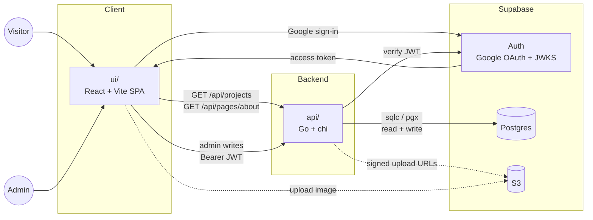
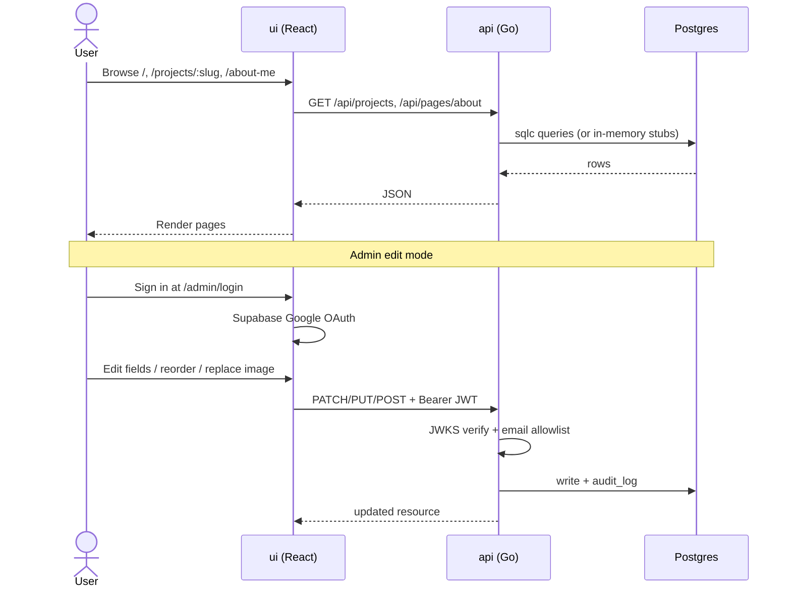

# mariamecoulibaly.com

Personal portfolio for Mariam Coulibaly. A React rebuild of the existing site at
[mariamecoulibaly.com](https://www.mariamecoulibaly.com/), with an admin edit mode
for drag-and-drop content editing.

This is a pnpm monorepo:

| Path | Description |
|------|-------------|
| [`ui`](./ui) | React 19 + Vite frontend |
| [`api`](./api) | Go backend (chi router) |
| [`shared`](./shared) | TypeScript types shared between `ui` and `api` |
| [`docs`](./docs) | Architecture and delivery plan |

## Tech stack

| Layer | Tech |
|-------|------|
| Frontend (`ui/`) | React 19, TypeScript, Vite, React Router v7, Tailwind CSS v4, Framer Motion, `@dnd-kit`, TipTap (planned), Vercel Web Analytics |
| Backend (`api/`) | Go 1.24, [chi](https://github.com/go-chi/chi), [koanf](https://github.com/knadh/koanf), [sqlc](https://sqlc.dev/) + [pgx/v5](https://github.com/jackc/pgx) |
| Database | **Postgres** via Supabase (migrations under `supabase/`) |
| Auth | Supabase Auth (Google OAuth) → JWT verified in Go against project JWKS + `API_ADMIN_EMAILS` allowlist |
| Media | **S3** via Supabase Storage (bucket `project-media`). Local `ui/public/images/` until the upload pipeline lands ([docs/PLAN.md](./docs/PLAN.md) §5.5) |
| Shared | TypeScript types as `@mariame/shared` (`shared/`) |
| Tooling | pnpm workspaces, oxlint + Vitest (`ui`), golangci-lint + `go test` (`api`), commitlint, GitHub Actions CI |
| Hosting | Vercel — `ui` (Vite SPA), `api` (Go Framework Preset) |

See [docs/PLAN.md](./docs/PLAN.md) for the full architecture, edit-mode design,
and phased delivery plan.

## Architecture

Public visitors hit the React SPA; the Go API reads published content from
Postgres (or in-memory stubs when `API_DATABASE_URL` is unset). Admins sign in
with Google via Supabase, then the UI sends Bearer JWTs on write routes.



Request flow (simplified):



## Getting started

Prerequisites: Node.js ≥ 22.12, [pnpm](https://pnpm.io/) 10, and Go 1.24+ (for
the API).

```bash
pnpm install     # installs ui + shared workspace deps
pnpm dev:ui      # http://localhost:5173
pnpm dev:api     # http://localhost:4000 (requires Go 1.24+)
```

Other useful commands from the repo root:

| Command | Description |
|---------|-------------|
| `pnpm --filter ui lint` | Lint the frontend with oxlint |
| `pnpm --filter ui test` | Run frontend tests with Vitest |
| `pnpm build:ui` | Type-check and build the frontend |
| `pnpm build:api` | Build the API binary to `api/bin/api` |
| `pnpm lint:commits` | Validate commit messages against Conventional Commits |

For workspace-specific details (config, endpoints, deployment, releasing),
see [`ui/README.md`](./ui/README.md) and [`api/README.md`](./api/README.md).

## Documentation

Project documentation lives in [`docs/`](./docs). Start with
[docs/PLAN.md](./docs/PLAN.md) for the architecture, feature scope, and delivery plan.
